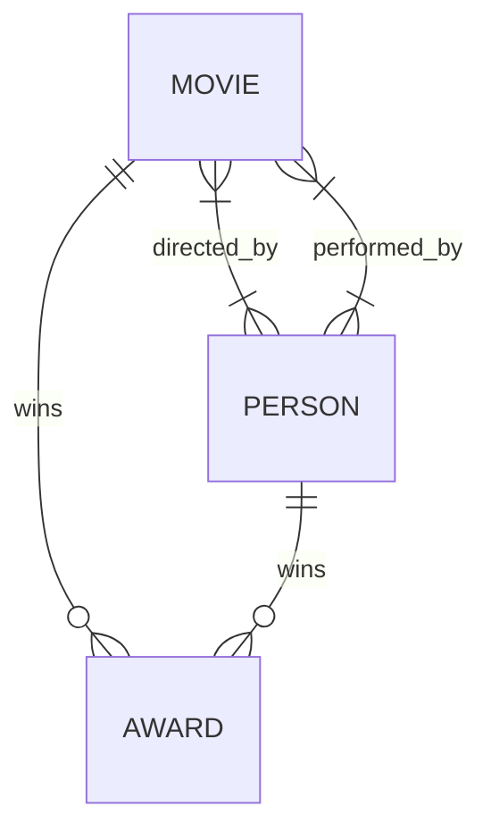

# PostgreSQL: Cinema Magazine Database

In this file, the steps to generate the database and insert data will be explained. Doing the exercise, you'll find some challenges that must be solved to create and fill the database successfully!

## Create the database

Create the database **cinema_magazine** with your PostgreSQL program. It can be done using **pgAdmin 4**, **visual studio code** or the **psql console**.

## Create the ERM diagram and Relational Model

### ERM Diagram
ERM diagram is the Entity-Relationship Model diagram.

Once it's done, it's time to create the tables: entity tables and relationship tables. *Remember, with M:N relationships it's necessary to create a relationship table, with 1:N relationships the entity with the 'many' gets the id of the related entity as foreign key.*

### Relational Model
Tables:
>*Primary key standard is specified with underlined, in this file, the primary key will be specified with `(pk)`.*
 - `Movie: (id (pk), title, synopsis)`
 - `Person: (id (pk), name, surname, birthday_date)`
 - `Award: (id (pk), name, year, id_movie*, id_person*)`
 - `Directed_by: (id_movie* (pk), id_person* (pk))`
 - `Performed_by: (id_movie* (pk), id_person* (pk))`

As you can see, the award table has two *foreign keys*: the movie id and the person id. That's because an award it's given to one movie and to one person but one person and one movie can win with a lot of awards. It means the relationship is `1:N` between *award-movie* and *award-person*. 

Then we have the relationships `directed_by` and `performed_by`. These relationship are `M:N`, because a movie can have more than one director and one person can be director in many movies. The same happens with the actors, they can perform in many movies and a movie has many people who performs on it. 

## Create tables: DDL

The creation tables sql code can be found in `movies_database.sql`. 
Tables will be created with **Data Definition Language**.

## Insert data: DML

The insert sql queries can be found in `insert_into_movies.sql`. 
Tables will be filled with data with **Data Manipulation Language**. 

### Problems found when inserting the data

1. Table **movie**:
	- The **synopsis column** is too short for the data we want to insert. The solution is update the column and change the type to text: `ALTER  TABLE movie ALTER  COLUMN synopsis SET  DATA  TYPE  text;`
	- The **title  column** is short too. Just the movie *'The Lord of the Rings: The Fellowship of the Ring'* doesn't fit in 30 characters. We update the column with a leght of 50 characters: `ALTER TABLE movie ALTER COLUMN title TYPE varchar(50);` 
	- After this steps the data will be inserted succesfully.
2. Table **award**:
	- Inserting appears an error about the year type. We want to insert a year type `int` (2003, 2005, 2009, ...) but when the table was created we give to the column the type `date`. If we try to apply the previous solution with the code `alter table award alter column year type int` we get this error: `column "year" cannot be cast automatically to type integer`. We need to find a second solution executed in two steps.
	- Step 1: delete the year column `alter table movie drop column`.
	- Step 2: add the column year with the int type: `alter table movie add column year int`.
	- After this steps the data will be inserted succesfully.
3. Table **performed_by**:
	- We get the error violation of the primary key. That's because, we can't repeat data in this table because id_movie and id_person, both of them, are a primary key. We found the 2nd row has the values `(1,6)` and the 10th row repeats the values `(1,6)`. We should remove one of them. It makes no sense that a person has performed two times in the same movie.

## Considerations
As you can see in all the previous examples updating data about tables. When we want to change something about a table, you must use always the command `ALTER TABLE table_name` follow by the modifications you want to do. 

In this practice we have seen the examples of:
- Update column type
`ALTER TABLE table_name ALTER COLUMN column_name TYPE new_type;`
- Drop column
`ALTER TABLE table_name DROP COLUMN column_name;`
- Add column
`ALTER TABLE table_name ADD COLUMN column_name TYPE;`
